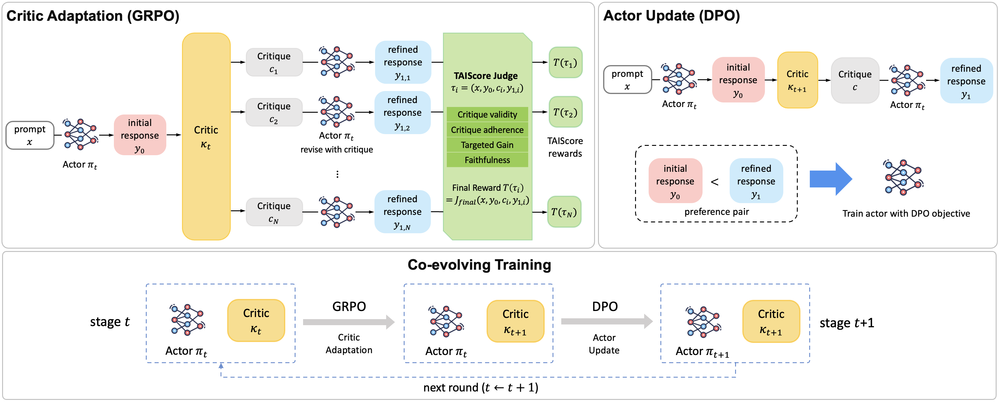

# TAIScore: Targeted Actionable Improvement Score

[]()
[](https://jiny1623.github.io/projects/taiscore/)
[](LICENSE)

Official code release for **Co-Evolving Actor-Conditioned Critics for Non-Verifiable Generation**.

**Authors:** [Jinyoung Kim](https://jiny1623.github.io), [Muhammad Khalifa](https://mukhal.github.io), [Lajanugen Logeswaran](https://lajanugen.github.io/), [Jaekyeom Kim](https://jaekyeom.github.io/), [Moontae Lee](https://moontae.github.io/), [Honglak Lee](https://web.eecs.umich.edu/~honglak/), [Lu Wang](https://web.eecs.umich.edu/~wangluxy/)

University of Michigan · NVIDIA · LG AI Research · University of Illinois Chicago



## Overview

TAIScore is a transition-level reward for training actor-conditioned critics on non-verifiable generation tasks such as creative writing and deep research. Instead of scoring a critique only by standalone critique quality or final response quality, TAIScore evaluates the full critique-guided revision transition:

```text
(prompt, initial response, critique, revised response)
```

The reward checks whether the critique identifies an important and actionable weakness, whether the actor follows the critique, whether the response improves, and whether the revision remains faithful to the original prompt.

This repository provides the TAIScore reward implementation used for critic GRPO training. It is compatible with OpenAI-style chat completion endpoints and the VeRL reward function interface.

## Installation

```bash
git clone https://github.com/jiny1623/taiscore.git
cd taiscore
pip install -e .
pip install -r requirements.txt
```

VeRL is required for GRPO training. If the PyPI package is not available in your environment, install VeRL from source following the official instructions:

```bash
pip install git+https://github.com/volcengine/verl.git
```

## Repository Structure

```text
taiscore/
  reward/
    taiscore.py        # TAIScore reward implementation
docs/
  data_format.md       # Public data schema
  endpoints.md         # Refiner/judge API contract
  training_pipeline.md # High-level training recipe
examples/
  score_transition.py  # Single-transition example
  batch_reward_example.py
scripts/
  run_coevolution_template.sh
  run_grpo_template.sh # GRPO command sketch
  run_dpo_template.sh  # DPO command sketch
tests/
  test_taiscore.py
assets/
  method.png           # Method overview figure
requirements.txt
pyproject.toml
LICENSE
```

## Usage

The main entry points are:

```python
from taiscore.reward import compute_score, compute_score_batched
```

For VeRL batch reward management, use `compute_score_batched`. Each rollout should provide:

- `solution_strs`: generated critiques
- `extra_infos[i]["user_prompt"]`: original user prompt
- `extra_infos[i]["draft_y0"]`: initial actor response
- `extra_infos[i]["example_id"]`: group id for GRPO normalization

Example:

```python
from taiscore.reward import compute_score_batched

scores = compute_score_batched(
    data_sources=["writing"] * 4,
    solution_strs=["The response should be more specific."] * 4,
    ground_truths=[None] * 4,
    extra_infos=[
        {
            "user_prompt": "Write a grant proposal.",
            "draft_y0": "Initial response text.",
            "example_id": "example-1",
        }
        for _ in range(4)
    ],
    refiner_base_url="http://localhost:8000",
    refiner_model="Qwen/Qwen3-8B",
    judge_base_url="http://localhost:8001",
    judge_model="openai/gpt-oss-120b",
)
```

Each returned item contains:

- `score`: group-normalized GRPO reward
- `raw_score`: raw TAIScore judge score from 1 to 10
- `judge_valid`: whether the judge output parsed successfully

## Examples and Tests

The examples show how to call TAIScore with OpenAI-compatible model endpoints:

```bash
python examples/score_transition.py \
  --refiner-base-url http://localhost:8000 \
  --judge-base-url http://localhost:8001

python examples/batch_reward_example.py \
  --refiner-base-url http://localhost:8000 \
  --judge-base-url http://localhost:8001
```

Run the unit tests with:

```bash
python -m unittest discover -s tests
```

See `docs/` for the expected data schema, endpoint contract, and high-level training pipeline.

## Co-Evolving Training

The co-evolving setup alternates critic GRPO and actor DPO across training rounds:

```bash
ROUNDS=3 \
RUN_ROOT=runs/coevolution \
SHARD_DIR=data/stage_shards \
BASE_ACTOR=Qwen/Qwen3-8B \
REFINER_BASE_URL=http://localhost:8000 \
JUDGE_BASE_URL=http://localhost:8001 \
bash scripts/run_coevolution_template.sh
```

The driver wires each round as:

```text
critic GRPO -> preference pair generation -> actor DPO
```

Set `DRY_RUN=0` after connecting the GRPO launcher, preference-pair generator, and DPO trainer used in your environment.

## TAIScore Dimensions

The judge scores four dimensions and an overall transition score:

- `critique_quality`: whether the critique is faithful, specific, important, and actionable
- `critique_uptake`: whether the revised response follows the critique
- `quality_gain`: whether the revised response improves over the initial response
- `prompt_faithfulness`: whether the critique and revision remain aligned with the prompt
- `score`: final transition-level reward

## Citation

```bibtex
@article{kim2026coevolving,
  title   = {Co-Evolving Actor-Conditioned Critics for Non-Verifiable Generation},
  author  = {Kim, Jinyoung and Khalifa, Muhammad and Logeswaran, Lajanugen and
             Kim, Jaekyeom and Lee, Moontae and Lee, Honglak and Wang, Lu},
  journal = {arXiv preprint},
  year    = {2026}
}
```
